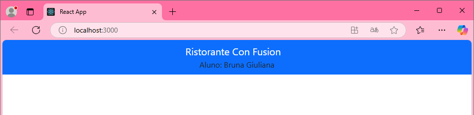

# Configuração do aplicativo React

Passos realizados

## 1 - Na prompt de comando foi digitado os seguintes códigos:

npm install reactstrap react react-dom 
npm install --save bootstrap 
npm install react-popper @popperjs/core

## 2 - Em seguida, a pasta "src" que foi criada na aula-5 foi aberta no Visual Studio Code e no arquivo 'index.js' foi adicionado essa linha:

import 'bootstrap/dist/css/bootstrap.min.css'

## 3 - Após isso, no arquivo 'App.js' na mesma pasta "src" foi apagado a parte da header do html e adicionado esse bloco de código: 

```js 
<Navbar dark color="primary"> 
    <div className="container"> 
        <NavbarBrand href="/">Ristorante Con Fusion</NavbarBrand> 
        <div>Aluno: Fulano de Tal</div> 
    </div> 
</Navbar> 
```

1. **`<Navbar dark color="primary">`**': Cria uma barra de navegação com fundo escuro e cor primária (geralmente azul).
2. **`<div className="container">`**: Centraliza o conteúdo da barra de navegação e garante espaçamento adequado nas laterais.
3. **`<NavbarBrand href="/">Ristorante Con Fusion</NavbarBrand>`**: Exibe o nome do site, "Ristorante Con Fusion", que é um link para a página inicial.
4. **`<div>Aluno: Bruna Giuliana</div>`**: Exibe a informação "Aluno: Fulano de Tal" ao lado do título.
5. Fechamento da tag **`'<Navbar>`**: Finaliza a barra de navegação.

Também foi alterado a o nome do aluno na div.

## 4 - Imagem do resultado


